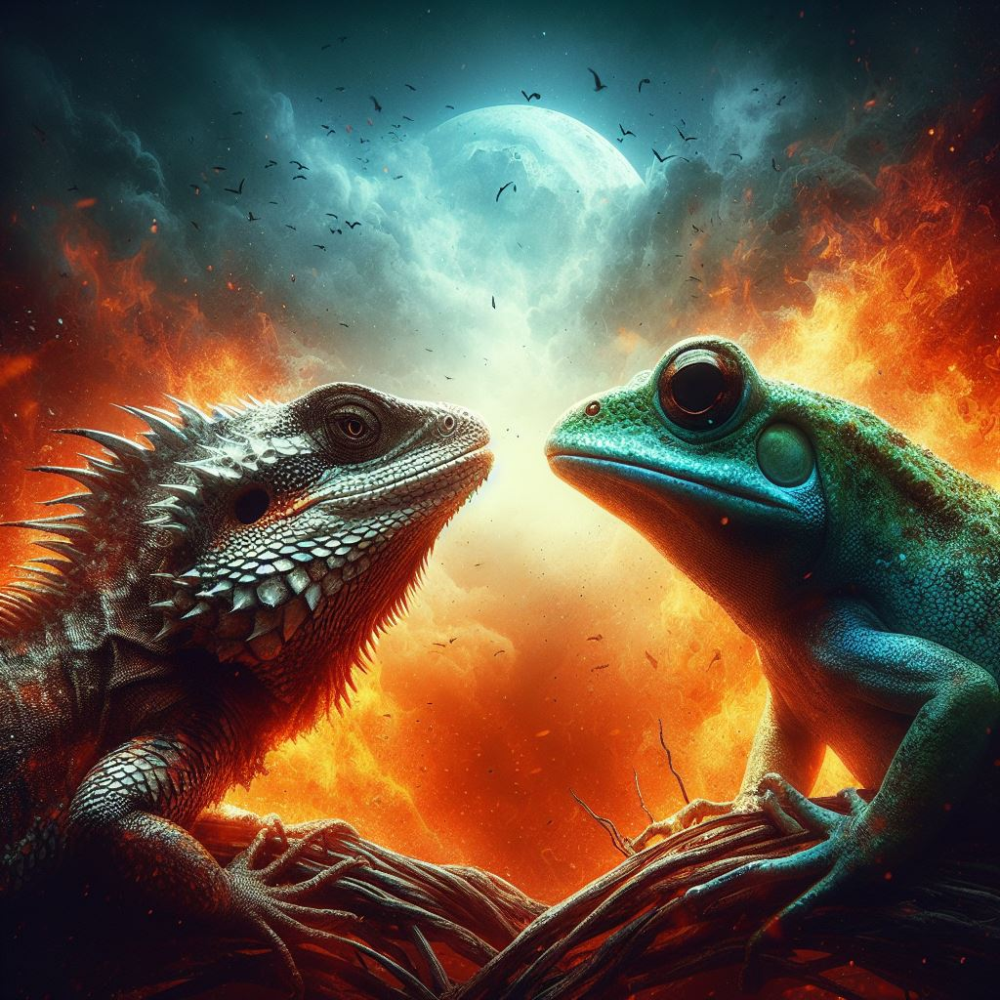

# Reptile Or Anphibian Classifier CNN

This repository contains the code and resources for a Machine Learning project aimed at classifying images of Reptiles and Amphibians with a Convolutional Neural Network using PyTorch.

## Overview

The project focuses on building a classifier capable of distinguishing between reptiles and amphibians based on image data. The classification task involves utilizing the ResNet-50 architecture from PyTorch, fine-tuning it, and training it on a custom dataset.

## Project Structure

- `Datasets/`: Contains the datasets used for training and evaluation (not in the repository).
- `Models/`: Stores the trained models.
- `Notebooks`: Jupyter notebooks used for data preprocessing, model training, and evaluation (Where the magic happens).
- `GraphicsImagesAndText/`: Contains some interesting graphs and recording of the data and the training process.

## Key Components

### 1. Data Preparation

- **Dataset Imbalance:** Two different training approaches were employed:
  - One using an imbalanced dataset with more reptile images than amphibians.
  - Another with a more balanced or similar distribution of reptile and amphibian images.

- **Data Augmentation:** Image augmentation techniques were applied to enhance dataset diversity and prevent overfitting, including rotation, flipping, and brightness formatting.

### 2. Model Training

- **Model Architecture:** The ResNet-50 model from PyTorch was fine-tuned for the reptile-amphibian classification task.
- **Training Strategy:** The model was trained both locally on CPU and on Colab GPU, showcasing efficiency gains in the latter due to faster training times.

### 3. Results and Findings

- **Training Results:** Two separate training sessions were conducted, highlighting:
  - Initial training with frozen ResNet-50 layers achieving the following accuracies:
    - 94% on training with Local CPU.
    - 94% on training with Colab GPU.
    - 95% on training and 96% on validation with Colab GPU and balanced data.
  - After unfreezing and retraining, accuracies improved significantly to:
    - 99% on training with Local CPU.
    - 99% on training with Colab GPU.
    - 99% on training and 96% on validation with Colab GPU and balanced data.
- **No Impact of Dataset Composition:** Contrary to what we assumed, the analysis revealed no differences in model performance based on the different compositions that were experimented with the data set. This is probably because when fine-tuning Resnet-50, such a powerful model, both dataset configurations were appropriate for training.

## Conclusion

The Reptile-Amphibian Classifier project showcases the process of fine-tuning a pre-trained ResNet-50 model for image classification. It highlights the significance of data augmentation, the efficiency gains obtained through GPU utilization and showed that both data compositions caused similar results in training .

For detailed information on the implementation and findings, please refer to the notebooks and charts provided.
For more information on ResNet-50 in PyTorch, visit the [ResNet-50 PyTorch Documentation](https://pytorch.org/vision/main/models/generated/torchvision.models.resnet50.html).
